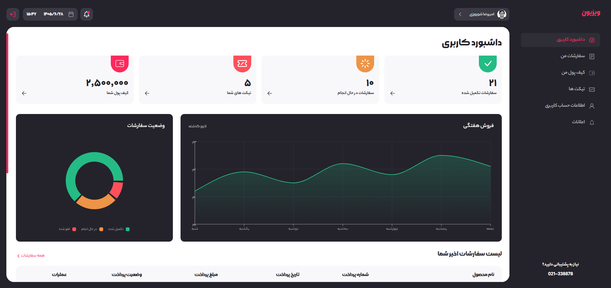
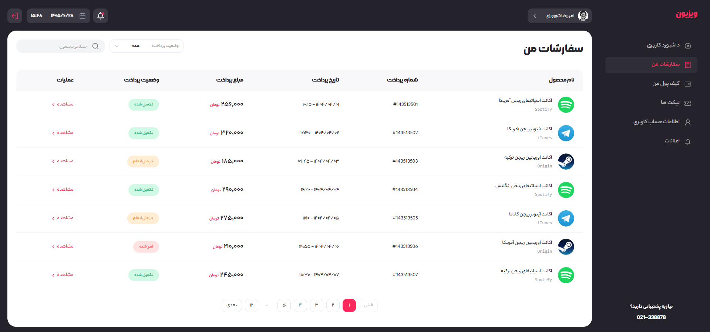
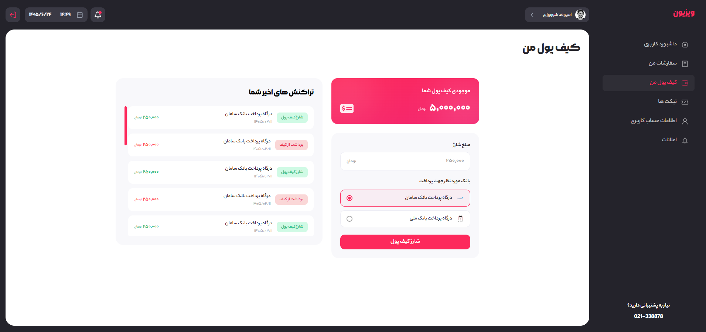
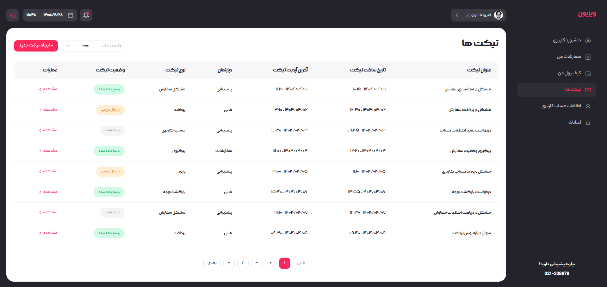
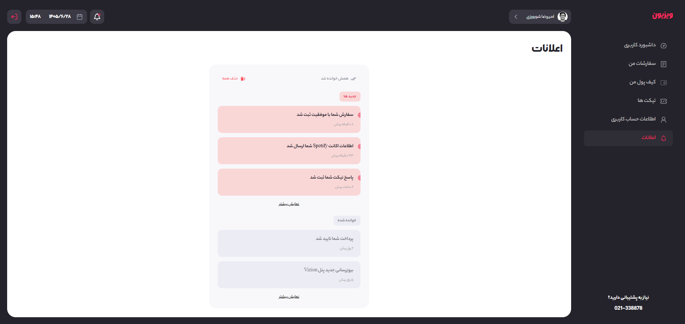
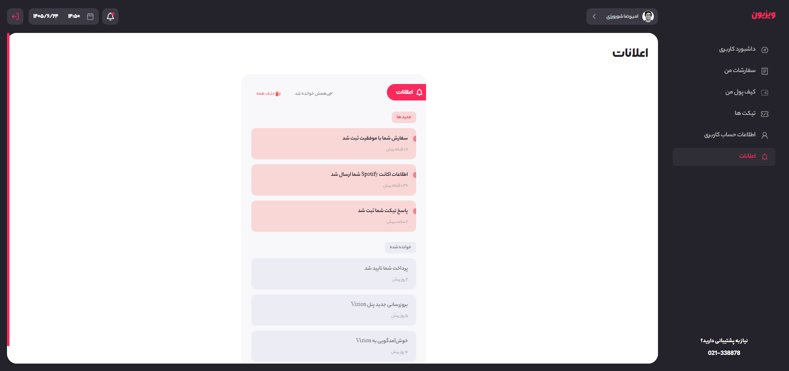

# 🎨 Vizion - Online Store Admin Panel

<div align="center">


**A modern, responsive and user-friendly admin panel for online stores**

[](https://react.dev/)
[](https://www.typescriptlang.org/)
[](https://tailwindcss.com/)
[](https://vitejs.dev/)

## 🔗 Live Demo

<div align="center">

**🚀 You can see the live demo here:**

[](https://vizion-pink.vercel.app)

</div>

---

## 📖 About The Project

**Vizion** is a modern online store admin panel designed to provide a smooth, fast and beautiful user experience. This project includes all the essential features of a professional admin panel, such as order management, support tickets, wallet, notifications, and user profile.

### ✨ Key Features

- 🎨 **Modern & Minimal Design** using Tailwind CSS v4
- 📱 **Fully Responsive** for mobile, tablet and desktop
- 🌐 **Complete RTL Support** with Persian fonts (YekanBakh, Morabba)
- ⚡ **High Performance** with Vite and React 19
- 🎯 **Type-Safe** with TypeScript
- 🔄 **State Management** with Zustand
- 📊 **Interactive Charts** with Recharts
- 🎬 **Smooth Animations** with Framer Motion
- 🔔 **Toast Notifications** with React Hot Toast
- 📝 **Form Management** with React Hook Form

---

## 📸 Screenshots

### 🏠 Dashboard



_Overview of the dashboard with stat cards, weekly sales chart and order status_

### 📦 Orders



_Order management with search, payment status filter and smart pagination_

### 💰 Wallet



_Balance management, wallet charging and recent transactions_

### 🎫 Tickets



_Complete ticketing system with status filter, details view and reply option_

### 🔔 Notifications



_Notifications with new/read grouping and relative time display_

### 👤 Profile



_Profile information management and password change_

---

## 🛠️ Tech Stack

### Frontend Core

| Technology       | Version | Purpose         |
| :--------------- | :------ | :-------------- |
| **React**        | 19.2    | Main UI library |
| **TypeScript**   | 5.x     | Type-Safety     |
| **Vite**         | 6.x     | Build Tool      |
| **React Router** | 8.3     | Routing         |

### Styling & UI

| Technology        | Version | Purpose    |
| :---------------- | :------ | :--------- |
| **Tailwind CSS**  | 4.3     | Styling    |
| **Framer Motion** | 13.2    | Animations |
| **React Icons**   | 5.7     | Icons      |
| **Recharts**      | 3.10    | Charts     |

### State & Data

| Technology          | Version | Purpose          |
| :------------------ | :------ | :--------------- |
| **Zustand**         | 5.0     | State Management |
| **Axios**           | 1.20    | HTTP Requests    |
| **React Hook Form** | 7.87    | Form Management  |

### Utilities

| Technology                    | Version | Purpose       |
| :---------------------------- | :------ | :------------ |
| **clsx** + **tailwind-merge** | -       | Class Merging |
| **React Hot Toast**           | 2.6     | Notifications |

---

## 🚀 Installation & Setup

### Prerequisites

- Node.js v18 or higher
- npm or yarn

### Installation Steps

```bash
# 1. Clone the repository
git clone https://github.com/amirrezash0n/vizion.git

# 2. Navigate to project folder
cd vizion

# 3. Install dependencies
npm install

# 4. Run development server
npm run dev

# 5. Build for production
npm run build
```

The project will be available at `http://localhost:5173`.

---

## 🎯 Implemented Features

### ✅ Main Sections

- [x] **Dashboard** with stat cards and charts
- [x] **Orders** with search, filter and pagination
- [x] **Wallet** with charging and transaction history
- [x] **Tickets** with reply system
- [x] **Notifications** with grouping and relative time
- [x] **User Profile** with password change
- [x] **Error Pages** (404)

### ✅ Technical Features

- [x] **Protected Routes**
- [x] **State Management** with Zustand + Persist
- [x] **Reusable Components**
- [x] **Smart Pagination** with Ellipsis
- [x] **Persian Number Conversion**
- [x] **Relative Time Display**
- [x] **Full RTL Support**
- [x] **Fully Responsive**

### 🚧 In Development

- [ ] **Backend Integration** (Supabase)
- [ ] **Full Authentication** (Login/Signup)
- [ ] **Unit Tests**
- [ ] **Dark Mode**

---

## 🎨 Design

### Color Palette

| Color             | Code      | Usage           |
| :---------------- | :-------- | :-------------- |
| **Primary**       | `#FD295C` | Brand primary   |
| **Secondary**     | `#F32770` | Complementary   |
| **Success**       | `#25BB85` | Success state   |
| **Warning**       | `#ED9446` | Warning state   |
| **Danger**        | `#FF505A` | Error state     |
| **BalticSea-400** | `#24232A` | Dark background |

### Fonts

- **YekanBakh** (Regular, Medium, Bold, Heavy)
- **Morabba** (Light, Medium, Bold)

---

## 💡 About Development

This project was built with a focus on **learning and implementing modern standards**. During development, **AI tools (DeepSeek)** were used as an assistant for:

- 🔍 **Bug fixing and debugging**
- 🏗️ **Component architecture design**
- 📐 **Code structure and Type-Safety improvement**
- 🎨 **UI/UX design**

All code has been **understood**, **tested** and **customized** according to the project's needs.

---

## 📌 Technical Notes

### Smart Pagination

Implementation of the **Ellipsis** pattern for pagination with many pages:

```
1 2 3 4 ... 50
1 ... 25 26 27 ... 50
1 ... 47 48 49 50
```

### State Management

- **Zustand** for global state
- **Persist Middleware** for LocalStorage
- **Partialize** to store only required fields

### Reusable Components

- `Button` with 10+ variants and sizes
- `DataTable` with pagination and scroll
- `Pagination` with Ellipsis
- `Filter` for filtering data
- `EmptyState` for empty states

---

## 🤝 Contributing

If you'd like to contribute to this project:

1. Fork the project
2. Create a new branch (`git checkout -b feature/amazing-feature`)
3. Commit your changes (`git commit -m 'Add amazing feature'`)
4. Push the branch (`git push origin feature/amazing-feature`)
5. Open a Pull Request

---

## 📄 License

This project is licensed under the **MIT** License.

---

## 📞 Contact Me

<div align="center">

**Amirreza Shourvarzi**

[](https://github.com/amirrezash0n)
[](mailto:shourvarziamirreza@gmail.com)
[](tel:+989154188878)

</div>

---

<div align="center">

**⭐ If you found this project useful, give it a star! ⭐**

Made with ❤️ by [Amirreza Shourvarzi](https://github.com/amirrezash0n)

</div>
